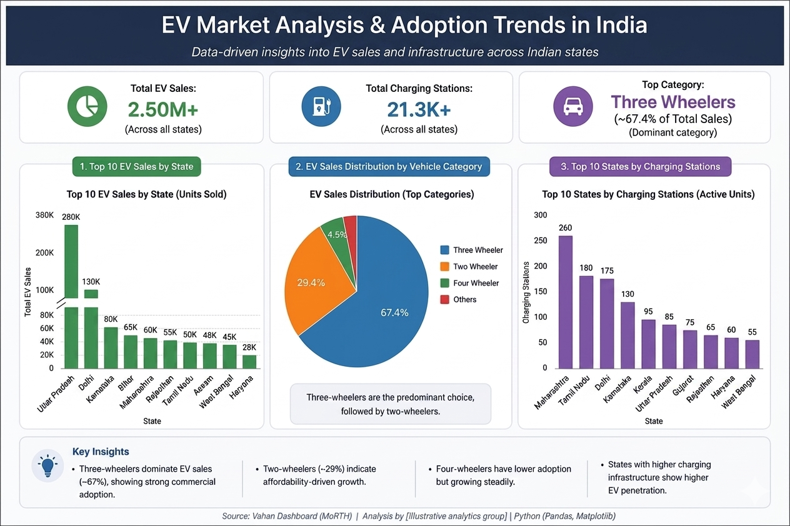

# 📊 EV Market Analysis & Adoption Trends in India

---
# 📊 EV Market Analysis & Adoption Trends in India

---

## 🎯 Business Problem

An EV manufacturer or charging-infrastructure investor needs to know **where to expand next** — which vehicle segments are actually driving adoption, and which states offer the best return on infrastructure investment. This analysis uses India's EV sales and charging-infrastructure data to answer that question with a specific, actionable recommendation rather than a general market overview.

---

## 🚀 Overview

This project analyzes Electric Vehicle (EV) adoption patterns across India using real-world sales and infrastructure data to identify where demand is concentrated, what's driving it, and where the biggest infrastructure gap — and therefore opportunity — exists.

---

## 🔍 Methodology

- Segmented EV sales by vehicle category (two-wheeler, three-wheeler, four-wheeler) to identify where volume is concentrated
- Compared state-wise EV adoption rates against state-wise charging-station density to test whether infrastructure availability tracks with adoption
- Ranked states by the gap between adoption rate and infrastructure density to surface underserved, high-opportunity markets

---

## 📈 Key Insights

- **Three-wheelers dominate EV adoption (~67%)**, driven primarily by commercial usage (last-mile delivery, shared autos) rather than personal ownership
- **Two-wheelers (~29%)** show adoption growth driven mainly by affordability rather than infrastructure availability — a different buyer motivation than three-wheelers
- **EV adoption strongly correlates with charging-infrastructure availability** — states with denser charging networks show consistently higher adoption, suggesting infrastructure is a leading (not lagging) indicator of demand
- States with high two-wheeler/three-wheeler adoption but comparatively thin charging infrastructure represent the clearest expansion opportunity

---

## 💡 Business Recommendations

1. **Prioritize commercial three-wheeler infrastructure first** — since three-wheelers already account for ~67% of adoption and are usage-driven (not price-sensitive like two-wheelers), infrastructure investment here has the most immediate, predictable payoff.
2. **Target two-wheeler-heavy, infrastructure-light states for expansion** — these are markets where adoption is being held back by affordability and access rather than by demand itself, making them a high-leverage next move.
3. **Trade-off to flag**: infrastructure build-out is capital-intensive and slower to deploy than demand can grow — recommend phased rollout starting with the top 3-5 highest-gap states rather than a simultaneous national expansion, to validate ROI before scaling further.

---

## 🛠 Tools Used

- Python
- Pandas
- Matplotlib

---

## 📊 Analysis Performed

- State-wise EV adoption trends
- Vehicle category segmentation
- Charging infrastructure distribution
- Adoption-vs-infrastructure gap analysis

---

## 🎯 Outcome

Turned raw EV sales and infrastructure data into a segmented, prioritized recommendation for where infrastructure investment would have the highest and most immediate impact — the kind of decision-ready output a market-entry or expansion strategy team would actually use.

---

## 📂 Project Files

- 📓 Notebook: `EV_Sales_Data_Analysis_(India).ipynb`
- 🖼 Dashboard Image: `ev_dashboard.png.png`
- 📦 Requirements: `requirements.txt`
